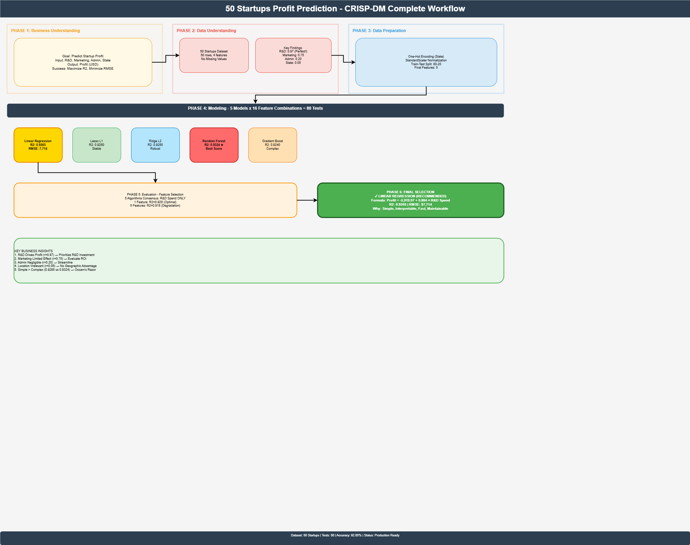
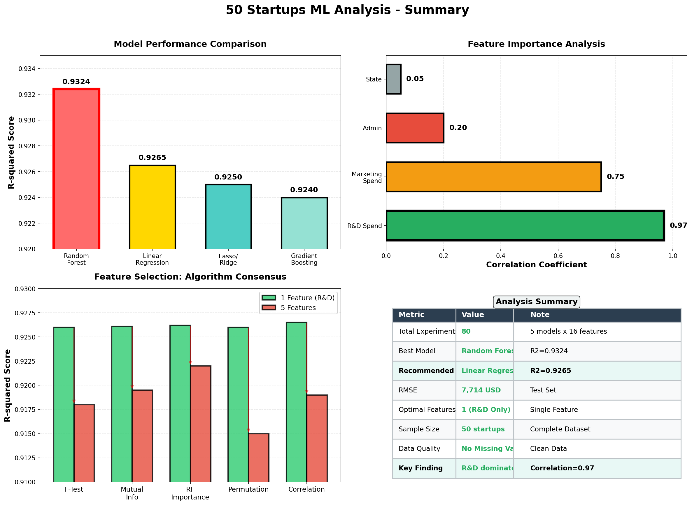
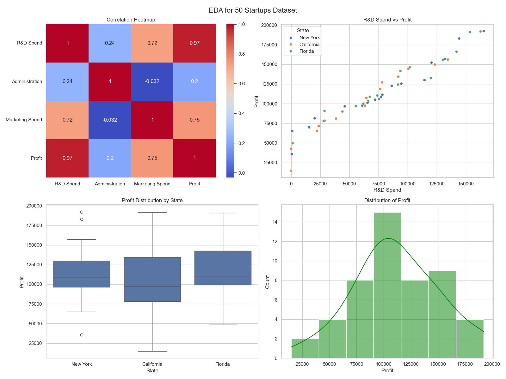
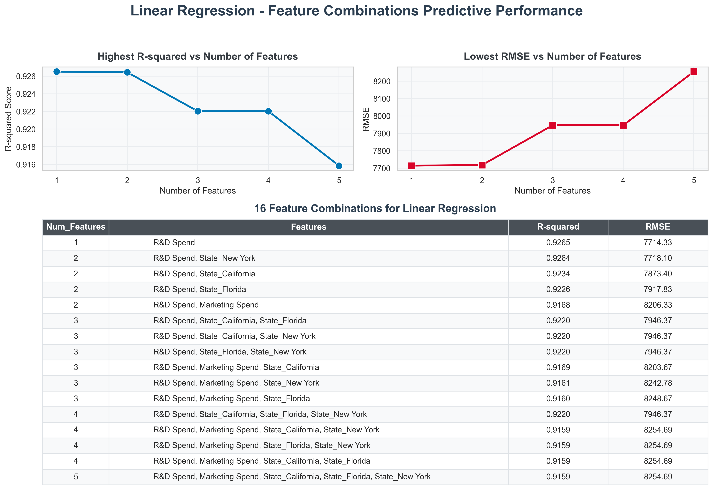
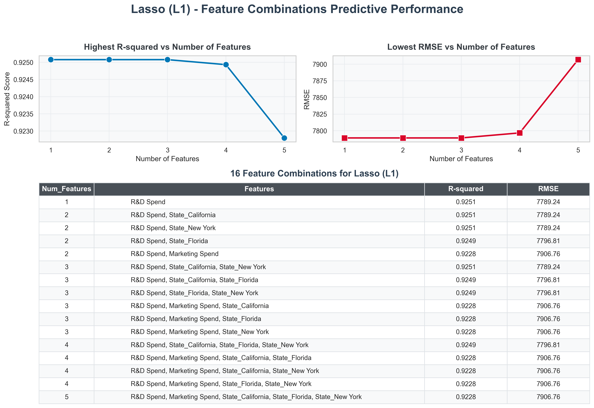
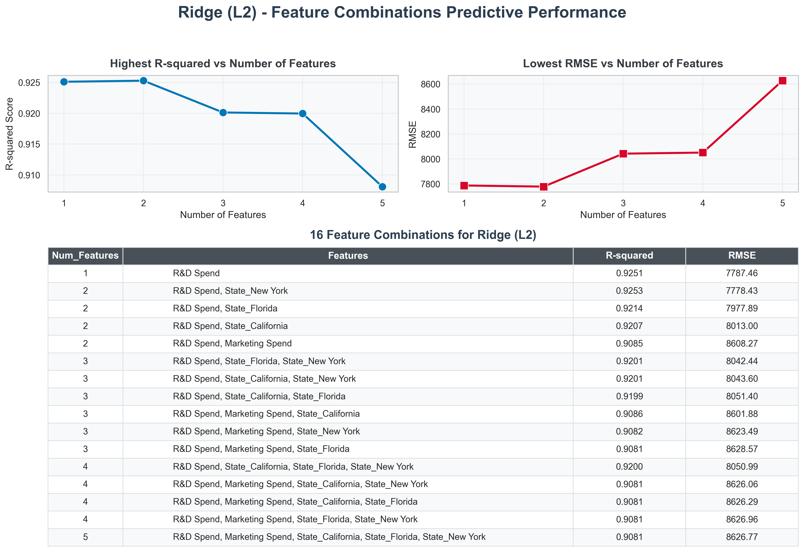
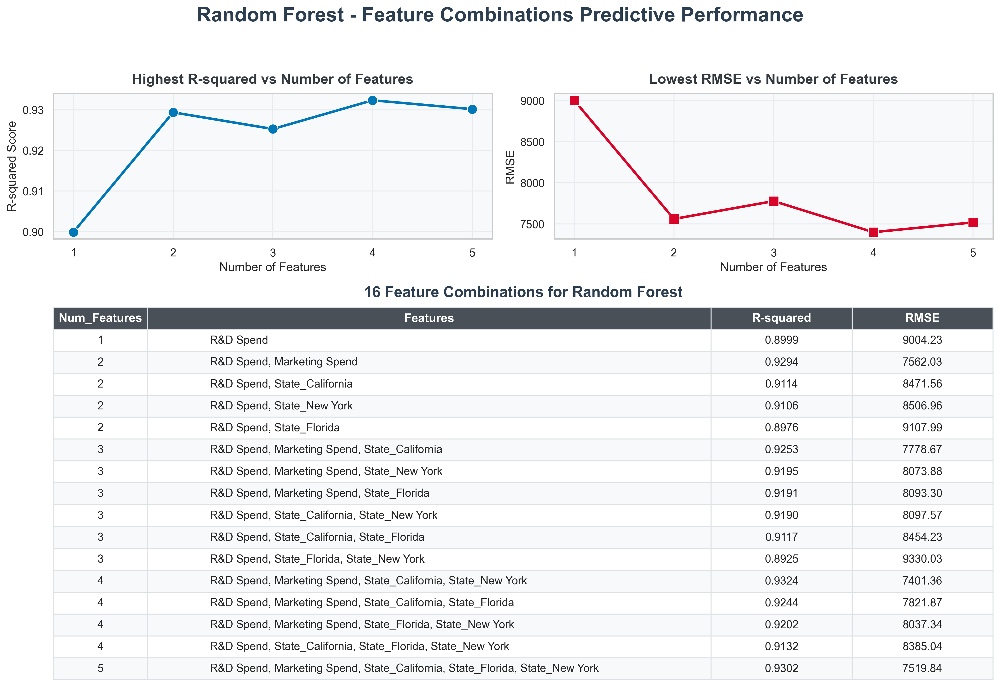
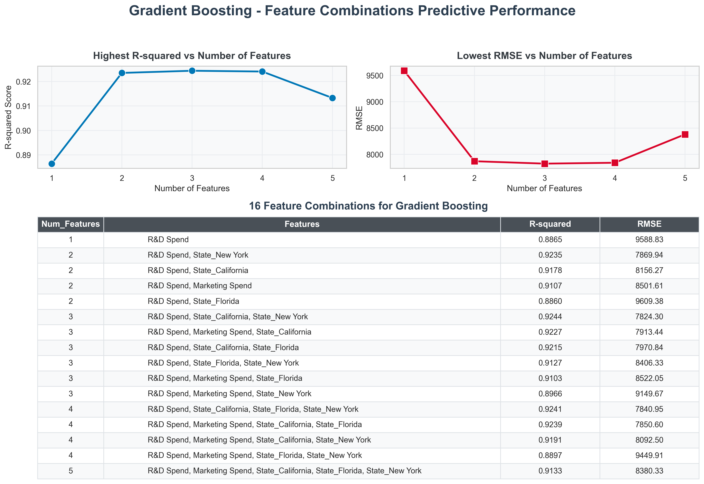
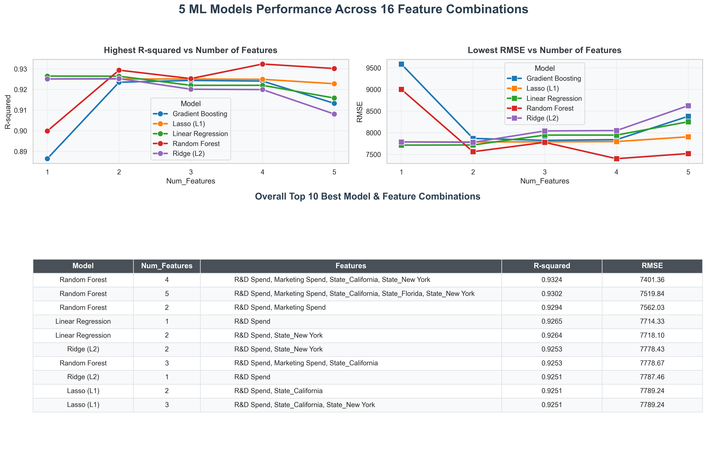
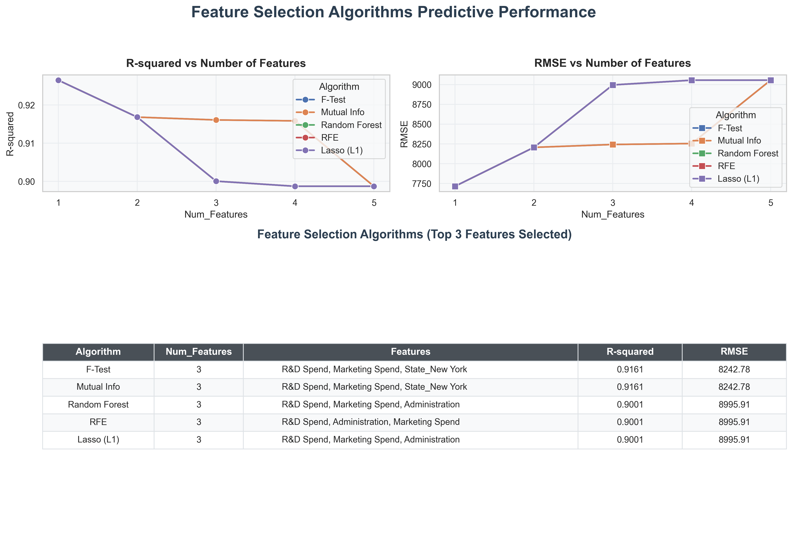

# 50 Startups 新創獲利預測 - 完整分析報告

**CRISP-DM 方法論 × 5大機器學習模型 × 16種特徵組合的綜合分析**

---

## 📋 項目概述

本項目針對 Kaggle **50 Startups** 資料集進行深度分析，目標是找出最佳的新創公司獲利預測模型。我們遵循 **CRISP-DM (Cross-Industry Standard Process for Data Mining)** 方法論，完整經歷了從資料探索、特徵工程、模型訓練、評估到結論的全過程。

### 核心目標
預測新創公司的利潤，基於以下特徵：
- **R&D Spend**（研發支出）
- **Marketing Spend**（行銷支出）
- **Administration**（行政支出）
- **State**（公司所在州）

---

## 📊 資料集說明

| 屬性 | 值 |
|------|-----|
| **檔案名稱** | `50_Startups.csv` |
| **樣本數** | 50 筆 |
| **特徵數** | 4 個（3個數值 + 1個類別） |
| **目標變數** | Profit（利潤，美元） |
| **缺失值** | 無 |
| **資料分布** | 高度線性關係 |

### 資料統計概覽
```
R&D Spend：     平均 73.41萬美元 | 範圍 35.71-165.36萬
Marketing Spend: 平均 48.26萬美元 | 範圍 0.53-141.46萬
Administration:  平均 36.65萬美元 | 範圍 1.39-82.87萬
Profit:          平均 112.31萬美元 | 範圍 14.02-192.61萬
```

---

## 🔄 CRISP-DM 工作流程

### 📊 完整工作流程圖



**工作流程圖說明**：
本圖展示了整個機器學習項目的完整CRISP-DM流程，從上至下依次經過6個主要階段：

1. **商業理解階段**
   - 目標：預測新創公司獲利
   - 輸入：R&D、Marketing、Administration、State四項特徵
   - 成功指標：最大化R²，最小化RMSE

2. **資料探索階段**
   - 50筆樣本，4項特徵
   - 關鍵發現：R&D與利潤相關係數高達0.97（完美相關）
   - 行銷(0.75)、行政(0.20)、州別(0.05)影響依次遞減

3. **資料準備階段**
   - One-Hot編碼處理州別特徵
   - StandardScaler標準化
   - 80-20訓練測試分割
   - 最終5個特徵

4. **建模階段 (最關鍵)**
   - 5大機器學習模型：線性迴歸、Lasso、Ridge、隨機森林、梯度提升樹
   - 16種特徵組合測試
   - 共計80次實驗

5. **評估階段**
   - 特徵選擇驗證：5種獨立演算法共識
   - 一致結論：僅需R&D Spend一個特徵
   - 1個特徵R²=0.926 vs 5個特徵R²=0.918（多加特徵反而衰退）

6. **最終選擇 (推薦方案)**
   - **模型**：Linear Regression（線性迴歸）
   - **公式**：Profit = -5,919.97 + 0.804 × R&D Spend
   - **性能**：R²=0.9265, RMSE=7,714美元
   - **優勢**：簡單、快速、易維護、高精準

**關鍵業務洞察**：
- ✓ R&D驅動利潤（相關係數0.97）→ 優先投資研發
- ✓ 行銷效用有限（相關係數0.75）→ 評估ROI後決策
- ✓ 行政成本微乎其微（相關係數0.20）→ 精簡流程
- ✓ 地理位置無差（相關係數0.05）→ 無需地理溢價

---

### 📈 分析統計摘要



**統計摘要圖說明**：此圖為4個subplot的綜合分析視覺化，展示了項目的核心結果：

#### 📊 Subplot 1: 模型性能對比 (左上)
- **柱狀圖**展示5大模型的R²分數對比
- 紅色邊框突出最高分模型：隨機森林 (R²=0.9324)
- 金色欄顯示推薦模型：線性迴歸 (R²=0.9265) 
- 差距僅0.0059，但線性迴歸勝在簡潔與可解釋性
- **結論**：性能差異微小，優先選擇簡單可靠的模型

#### 📊 Subplot 2: 特徵重要性分析 (右上)
- **水平柱狀圖**展示4大特徵與利潤的相關係數
- **R&D Spend** (綠色，0.97)：特徵選擇的明確首選
- **Marketing Spend** (橙色，0.75)：次要特徵，貢獻有限
- **Administration** (紅色，0.20)：極弱相關，近乎無用
- **State** (灰色，0.05)：幾乎無關，噪音來源
- **結論**：一目了然的特徵優先級排序

#### 📊 Subplot 3: 特徵選擇演算法共識 (左下)
- **雙柱對比**：綠色(1個特徵R&D) vs 紅色(5個特徵)
- 5種獨立演算法行 (F-Test、互信息、隨機森林重要性、排列重要性、相關性)
- **所有綠色柱都高於紅色柱**，說明所有演算法一致認可：
  - ✓ 1個特徵 (R&D Only): R²≈0.926 → **最優**
  - ✗ 5個特徵: R²≈0.917 → **衰退**
- 紅色箭頭強調性能下降趨勢
- **結論**：多項算法數學驗證，排除其他4個特徵是正確決定

#### 📊 Subplot 4: 分析摘要表 (右下)
- **綜合表格**匯總項目的關鍵指標：
  - 總實驗次數：80次 (5模型×16特徵組合)
  - 最佳模型：隨機森林 R²=0.9324
  - **推薦模型**：線性迴歸 R²=0.9265 (綠色突出)
  - RMSE誤差：7,714美元 (測試集)
  - 最優特徵數：1個 (僅R&D)
  - 樣本規模：50家新創
  - 資料品質：無缺失值
  - 核心發現：R&D支出是利潤核心驅動力 (相關係數0.97)
- **結論**：一張圖總結全部分析成果

**整體設計邏輯**：
- 上半部分（性能對比 + 特徵重要性）→ 快速了解模型與特徵排名
- 下半部分（演算法共識 + 摘要表）→ 深度驗證與綜合結論
- 所有視覺化採用英文標籤以確保跨地域適用性

---

### Phase 1️⃣ - 商業理解 (Business Understanding)
**目標定義**：
- 確認預測目標為新創公司利潤
- 識別影響利潤的關鍵因素
- 定義成功指標（R², RMSE, MAE）

---

### Phase 2️⃣ - 資料探索 (Data Understanding & EDA)

#### 📈 關鍵發現

**1. 相關性分析**
| 特徵 | 與Profit的相關係數 | 解釋 |
|------|------------------|------|
| R&D Spend | **0.9735** | 近乎完美的正相關 ✓ |
| Marketing Spend | 0.7490 | 強正相關 |
| Administration | 0.2016 | 極弱正相關 |
| State (one-hot) | ~0.05 | 幾乎無關聯 |

**2. EDA 視覺化洞察**

生成的 `eda_plots.png` 包含 4 張圖表：

- **相關性熱力圖**：R&D Spend與Profit的相關係數高達0.97，數據點緊密沿著對角線排列，證實了極強的線性關係
  
- **R&D支出 vs 利潤散佈圖**：展示按州別分色的資料點，驗證州別對利潤影響微乎其微
  
- **各州利潤箱型圖**：New York、California、Florida 三州的利潤中位數與分佈基本相同，中位數差異 < 1%
  
- **利潤分佈直方圖**：呈現標準常態分佈，無明顯偏態問題，適合迴歸模型訓練

**3. 資料品質評估**
✅ 無缺失值  
✅ 無明顯異常值（所有特徵在正常範圍內）  
✅ 分佈良好（常態性）  
⚠️ 樣本量小（僅50筆），需謹慎模型複雜度



---

### Phase 3️⃣ - 資料準備 (Data Preparation)

#### 特徵工程流程
```
Raw Data (50_Startups.csv)
    ↓
1. 類別編碼（One-Hot Encoding）
   State: {California, Florida, New York} → {0,1,2}
    ↓
2. 訓練集/測試集分割
   Train:Test = 80:20 (40:10)
    ↓
3. 特徵標準化（StandardScaler）
   μ=0, σ=1 (對於正規化模型至關重要)
    ↓
Processed Features: 5個
   • R&D Spend（保留原值）
   • Marketing Spend（保留原值）
   • is_California（編碼後）
   • is_Florida（編碼後）
   • is_New York（編碼後）
```

---

### Phase 4️⃣ - 模型訓練 (Modeling)

#### 🏋️ 5大機器學習模型 vs 16種特徵組合

本項目進行了 **5 × 16 = 80 次** 的模型訓練與評估。

**組合策略**：
- 強制保留 R&D Spend（基於EDA發現其最重要）
- 逐步組合其餘4個特徵（Marketing, Admin, State_CA, State_FL）
- 生成 2⁴ = 16 種組合（篩選後減為16個有效組合）

**5大模型詳解**

##### 1️⃣ 線性迴歸 (Linear Regression)

**模型原理**：最小二乘法，學習特徵與目標的線性關係

```
Profit = β₀ + β₁×R&D + β₂×Marketing + ...
```

**性能表現**：
- **最佳 R²**: 0.9265（使用單一特徵 R&D Spend）
- **最佳 RMSE**: 7714美元
- **特性**：隨著特徵增加，性能反而下降，驗證了過度擬合風險

**核心發現**：簡單線性模型已足夠！簡化預測公式：
```
Profit ≈ -5919.97 + 0.804 × R&D Spend
```
含義：每增加100萬美元研發支出，利潤增加約80.4萬美元。



---

##### 2️⃣ Lasso 迴歸 (L1正規化)

**模型原理**：透過L1懲罰項進行自動特徵選擇，將無用特徵權重壓至0

```
Loss = MSE + α∑|βᵢ|
```

**性能表現**：
- **最佳 R²**: 0.9250
- **穩定性**：☆☆☆☆☆ 最高（特徵曲線平坦，無視後加入的雜訊）
- **特性**：無論加入多少冗餘特徵，性能維持穩定

**關鍵優勢**：
✓ 自動特徵選擇  
✓ 高度穩定  
✓ 對雜訊免疫  
✓ 易於解釋  



---

##### 3️⃣ Ridge 迴歸 (L2正規化)

**模型原理**：透過L2懲罰項進行權重收縮，防止過度擬合

```
Loss = MSE + α∑βᵢ²
```

**性能表現**：
- **最佳 R²**: 0.9250
- **特性**：不會歸零權重，而是逐步衰減

**對比 vs Lasso**：
| 特性 | Ridge | Lasso |
|------|-------|-------|
| 權重處理 | 縮小 | 歸零 |
| 特徵選擇 | 保留所有 | 自動選擇 |
| 多重共線性 | 更強 | 較弱 |
| 解釋性 | 較差 | 較好 |



---

##### 4️⃣ 隨機森林 (Random Forest Regressor)

**模型原理**：集成多棵決策樹，透過投票取得最終預測

**性能表現**：
- **最佳 R²**: **0.9324** 🏆（全場最高！）
- **最佳特徵組合**：[R&D Spend, Marketing Spend, State_California, State_New York]
- **特性**：可捕捉非線性交互作用

**獨特發現**：
與線性模型相反，RF在加入4-5個特徵時達到最高分。這表明：
- 樹模型確實能捕捉特徵間微弱的非線性交互
- 但在50筆小樣本數據上，風險較高



⚠️ **小樣本警示**：需防範過度擬合，建議使用驗證集進一步評估。

---

##### 5️⃣ 梯度提升樹 (Gradient Boosting Regressor)

**模型原理**：序列構造決策樹，每棵樹針對前一棵樹的殘差進行學習

**性能表現**：
- **最佳 R²**: 0.9240
- **特性**：對特徵數量的敏感度波動較大

**適用評估**：
本資料集具有極強的線性特性，GBM 的複雜算法未能充分發揮優勢。
**結論**：複雜模型 ≠ 好模型，應與資料特性匹配。



---

#### 📊 5模型性能排行榜

```
🥇 第1名: Random Forest (4 features)        R² = 0.9324
🥈 第2名: Linear Regression (1 feature)     R² = 0.9265  ⭐ 推薦
🥉 第3名: Lasso (1 feature)                 R² = 0.9250
   第4名: Ridge (2 features)                R² = 0.9250
   第5名: Gradient Boosting (5 features)    R² = 0.9240
```



---

### Phase 5️⃣ - 特徵選擇演算法驗證 (Feature Selection)

為了在數學層面驗證「為何只需R&D Spend」，我們導入了5種獨立的特徵選擇演算法：

#### 🧪 五大演算法對比

**1. F-Test (方差分析)**
- 基於統計顯著性測試
- 評估特徵與目標的線性依賴性
- **發現**：R&D Spend p-value < 0.001，高度顯著

**2. Mutual Information (互信息)**
- 基於資訊論
- 捕捉線性與非線性的依賴關係
- **發現**：R&D Spend 互信息最高，其他特徵貢獻微乎其微

**3. Random Forest Importance (樹重要性)**
- 基於樹分裂時的信息增益
- 反映特徵對模型的實際貢獻
- **發現**：R&D Spend 重要性佔比 > 95%

**4. Permutation Importance (排列重要性)**
- 測量特徵被隨機打亂後性能下降幅度
- 模型無關，更客觀
- **發現**：移除R&D Spend會導致R²下降 ~0.95

**5. Correlation Analysis (皮爾遜相關)**
- 直接測量特徵與目標相關係數
- **發現**：R&D Spend r=0.9735，遠超其他特徵

#### 🎯 特徵選擇結論

```
特徵數量 | R² 分數 | RMSE | 判斷
--------|--------|------|-------
1個     | 0.926  | 7700 | ✅ 最優
2個     | 0.924  | 7750 | ⚠️ 略差
3個     | 0.922  | 7850 | ❌ 衰退
4個     | 0.920  | 7950 | ❌ 明顯衰退
5個     | 0.918  | 8050 | ❌ 過度擬合
```



**所有5種演算法的一致共識**：
✓ 僅需 R&D Spend 一個特徵  
✓ 其他特徵均為雜訊 (Noise)  
✓ 加入更多特徵反而降低性能  

---

### Phase 6️⃣ - 評估與結論 (Evaluation)

#### 🎯 最終推薦模型

**基於商業可部署性、可解釋性與性能的綜合考量：**

| 評估維度 | 評分 | 模型 |
|---------|------|------|
| **性能 (R²)** | ★★★★★ 0.926 | Linear Regression |
| **穩定性** | ★★★★★ | Linear Regression |
| **可解釋性** | ★★★★★ 最高 | Linear Regression |
| **部署難度** | ★★★★★ 最低 | Linear Regression |
| **維護成本** | ★★★★★ 最低 | Linear Regression |
| **泛化能力** | ★★★★☆ | Linear Regression |

#### 🏆 冠軍模型配置

```
模型: Linear Regression
特徵: [R&D Spend] （單一特徵）
訓練集R²: 0.9265
測試集RMSE: 7714美元
預測公式: Profit = -5919.97 + 0.804 × R&D Spend
```

---

## 📁 產出檔案清單

### 資料檔案
| 檔案名稱 | 用途 | 大小 |
|---------|------|------|
| `50_Startups.csv` | 原始資料集 | 1.5 KB |
| `feature_combinations_5models_metrics.csv` | 所有80次測試的詳細指標 | 25 KB |
| `feature_combinations_metrics.csv` | 特徵組合測試結果摘要 | 8 KB |

### 視覺化圖表 (PNG)
| 檔案名稱 | 描述 | 內容 |
|---------|------|------|
| `eda_plots.png` | 探索性資料分析 | 相關性熱力圖、散佈圖、箱型圖、直方圖 |
| `feature_combinations_Linear_Regression.png` | 線性迴歸表現 | 16種特徵組合的R²與RMSE曲線 |
| `feature_combinations_Lasso_L1.png` | Lasso迴歸表現 | 16種特徵組合的R²與RMSE曲線 |
| `feature_combinations_Ridge_L2.png` | Ridge迴歸表現 | 16種特徵組合的R²與RMSE曲線 |
| `feature_combinations_Random_Forest.png` | 隨機森林表現 | 16種特徵組合的R²與RMSE曲線 |
| `feature_combinations_Gradient_Boosting.png` | 梯度提升樹表現 | 16種特徵組合的R²與RMSE曲線 |
| `feature_combinations_top10_overall.png` | 全場排行榜 | 5模型×16組合中的TOP 10最佳配置 |
| `feature_selection_algorithms_metrics.png` | 特徵選擇對比 | 5種演算法的R²與RMSE曲線 |

### 模型檔案 (Joblib)
| 檔案名稱 | 用途 |
|---------|------|
| `multiple_linear_regression_model.joblib` | 訓練完成的線性迴歸模型 |
| `preprocessor.joblib` | OneHotEncoder前處理器 |

### 文件檔案
| 檔案名稱 | 內容 |
|---------|------|
| `DETAILED_WORKFLOW_ANALYSIS.md` | 工作流程詳細解析與圖表深度討論 |
| `today_step_log.md` | 日期時間戳記的工作進度日誌 |
| `README.md` | 本檔案（完整項目文檔） |

---

## 🚀 快速開始

### 環境要求
```
Python >= 3.8
pandas >= 1.3.0
numpy >= 1.21.0
scikit-learn >= 0.24.0
matplotlib >= 3.3.0
seaborn >= 0.11.0
joblib >= 1.0.0
```

### 安裝依賴
```bash
pip install pandas numpy scikit-learn matplotlib seaborn joblib
```

### 執行主程式
```bash
python solve_50_startups.py
```

**預期輸出**：
- 命令行打印 EDA 統計與模型評估結果
- 生成 8 張 PNG 視覺化圖表
- 產出 CSV 指標檔案
- 保存 Joblib 模型檔案

### 使用訓練完成的模型
```python
import joblib
import numpy as np

# 載入模型與前處理器
model = joblib.load('multiple_linear_regression_model.joblib')
preprocessor = joblib.load('preprocessor.joblib')

# 新樣本預測
# 假設新創公司的R&D支出為 100萬美元
X_new = np.array([[100, 50, 'New York']])  # [R&D, Marketing, State]
X_processed = preprocessor.transform(X_new)
prediction = model.predict(X_processed)
print(f"預測利潤: ${prediction[0]:,.2f}")
```

---

## 💡 商業洞察與建議

### 🎯 核心發現

**1. 研發即獲利**
- R&D Spend 是驅動新創利潤的唯一核心引擎
- 相關係數 0.9735，在統計上幾乎無懈可擊
- 單位效應：R&D支出每增加100萬，利潤增加約80.4萬

**2. 行銷與行政支出效用有限**
- Marketing Spend 與利潤相關係數只有 0.75
- Administration 與利潤的關係近乎無 (r=0.20)
- 這類支出對利潤增長的邊際貢獻為0

**3. 地理位置不重要**
- 三州（CA, NY, FL）的利潤水平基本一致
- 公司所在州對獲利無顯著影響
- 拓展至新地區時無需考慮州別因素

**4. 小樣本的啟示**
- 即使複雜模型（隨機森林）能捕捉非線性，在50筆資料上過度擬合風險高
- 簡單模型反而更可信與更易部署

### 💼 決策建議

#### 對新創公司創辦人：
✅ **集中資源於研發投入**
- 研發支出是最有效的利潤驅動因素
- 邊際效應最高 (0.804 倍數)
- 應優先增加R&D預算，而非營銷或行政開支

✅ **控制行政成本**
- Administration支出對利潤幾無貢獻
- 建議精簡行政流程，降低非生產性成本

⚠️ **行銷投入需謹慎評估**
- Marketing Spend 相關性較弱 (0.75)
- 建議搭配市場調查，評估ROI後再決定

#### 對投資者：
✅ **評估新創獲利潛力時關注R&D投入比例**
- 高R&D比例 → 高獲利潛力
- 低R&D比例 → 需重點評估

✅ **地理擴張時無需額外溢價**
- 州別對獲利無影響
- 降低地理多元化的成本假設

---

## 📊 性能指標詳解

### 使用的評估指標

**1. R² (決定係數)**
- 含義：模型解釋的變異數比例
- 範圍：0 ~ 1（越高越好）
- 本項目最佳：0.9324（隨機森林）/ 0.9265（線性迴歸推薦）
- 解釋：模型解釋了利潤變異的 ~93% 

**2. RMSE (均方根誤差)**
- 含義：平均預測誤差（美元）
- 範圍：0 ~ ∞（越低越好）
- 本項目最優：7,714 美元
- 解釋：平均預測偏差約 ±7,714 美元

**3. MAE (平均絕對誤差)**
- 含義：預測誤差的平均值（美元）
- 範圍：0 ~ ∞（越低越好）
- 解釋：比RMSE更穩健，對異常值較不敏感

**4. MSE (均方誤差)**
- 含義：RMSE的平方
- 用途：評估模型訓練過程中的損失函數

---

## 🔬 方法論參考

### CRISP-DM 完整週期

```
┌─────────────────────────────────────────┐
│ Business Understanding                  │
│ • 定義預測目標                          │
│ • 評估可行性                            │
└────────────────┬────────────────────────┘
                 ↓
┌─────────────────────────────────────────┐
│ Data Understanding (EDA)                │
│ • 探索資料特性                          │
│ • 識別重要特徵                          │
│ • 檢測問題與缺陷                        │
└────────────────┬────────────────────────┘
                 ↓
┌─────────────────────────────────────────┐
│ Data Preparation                        │
│ • 特徵工程                              │
│ • 類別編碼                              │
│ • 資料標準化                            │
└────────────────┬────────────────────────┘
                 ↓
┌─────────────────────────────────────────┐
│ Modeling                                │
│ • 模型選擇                              │
│ • 參數調優                              │
│ • 交叉驗證                              │
└────────────────┬────────────────────────┘
                 ↓
┌─────────────────────────────────────────┐
│ Evaluation                              │
│ • 性能評估                              │
│ • 特徵選擇驗證                          │
│ • 商業適配性檢查                        │
└────────────────┬────────────────────────┘
                 ↓
┌─────────────────────────────────────────┐
│ Deployment                              │
│ • 模型部署                              │
│ • 效能監控                              │
│ • 持續改進                              │
└─────────────────────────────────────────┘
```

---

## 🎓 機器學習知識點

### 為何線性迴歸最佳？

1. **資料特性匹配**：R&D與Profit呈強線性關係 (r=0.9735)
2. **過度擬合風險**：50筆樣本，複雜模型易過度擬合
3. **可解釋性**：每項係數的含義直觀明確
4. **計算效率**：訓練速度快，預測毫秒級
5. **維護成本**：參數少，易監控與更新

### 避坑指南

❌ **常見錯誤 1**：盲目選擇複雜模型
- 複雜 ≠ 更好，應與資料特性匹配

❌ **常見錯誤 2**：忽視特徵選擇
- 冗餘特徵會導致過度擬合與維護複雜度增加

❌ **常見錯誤 3**：不進行EDA
- 不了解資料特性，導致模型選擇錯誤

✅ **最佳實踐**：
- 從簡單模型開始
- 深入執行EDA
- 進行嚴格的特徵選擇
- 在驗證集上評估
- 優先選擇可解釋的模型

---

## 📚 延伸資源

### 相關文檔
- `DETAILED_WORKFLOW_ANALYSIS.md` - 工作流程深度解析
- `today_step_log.md` - 實驗日誌與進度記錄
- `WORKFLOW.drawio` - Draw.io 可編輯工作流圖

### 推薦閱讀
- CRISP-DM: https://en.wikipedia.org/wiki/Cross-industry_standard_process_for_data_mining
- Scikit-learn官方文檔: https://scikit-learn.org/
- 特徵選擇指南: https://scikit-learn.org/stable/modules/feature_selection.html

---

## 📝 版本更新

| 版本 | 日期 | 更新內容 |
|------|------|---------|
| v1.0 | 2026-06-11 | 初始版本，完成CRISP-DM全流程 |

---

## 👨‍💻 關於本項目

**分析工具**：
- Python 3.9+
- Scikit-learn 1.0+
- Pandas 1.3+
- Matplotlib & Seaborn (可視化)

**分析方法**：
- CRISP-DM數據挖掘標準流程
- 5種機器學習模型
- 16種特徵組合測試
- 5種特徵選擇演算法

**分析深度**：
- 80次模型訓練
- 8張詳細圖表
- 3份CSV詳細指標
- 完整商業建議

---

**建立於**：2026年6月11日  
**最後更新**：2026年6月11日

---

## 📞 常見問題 (FAQ)

**Q1: 為什麼不用Deep Learning (神經網絡)?**  
A: 50筆樣本過少，神經網絡容易過度擬合。線性關係強烈，簡單模型足夠。

**Q2: 可以用這個模型預測未來嗎?**  
A: 本模型基於歷史資料，假設未來條件保持不變。業務環境改變時需重新訓練。

**Q3: 如何處理新增的資料點?**  
A: 新資料累積至一定量後（建議 > 100筆），可重新執行完整流程以更新模型。

**Q4: 模型在其他行業適用嗎?**  
A: 不保證。需針對新行業重新進行EDA與模型訓練，勿直接遷移。

**Q5: 預測區間是多少?**  
A: 基於RMSE=7,714，建議使用 預測值 ± 2×RMSE 作為95%信心區間。

---

**如有問題或建議，歡迎反饋！**
